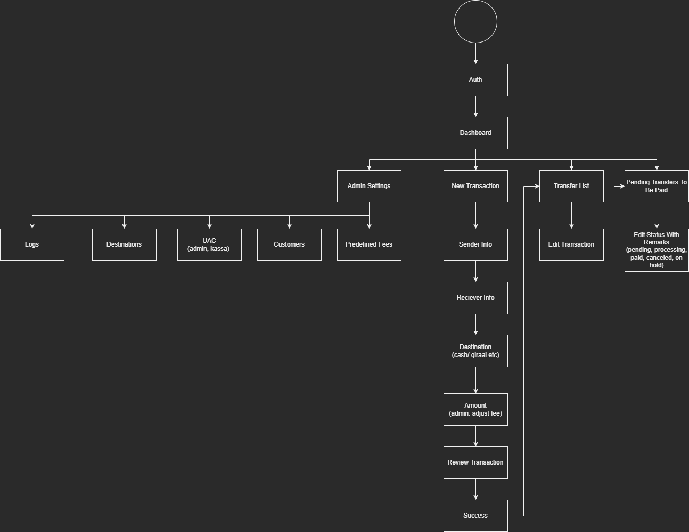
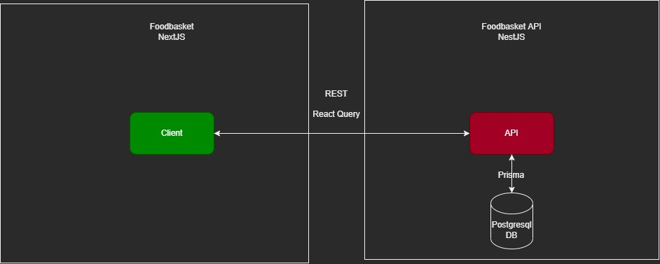
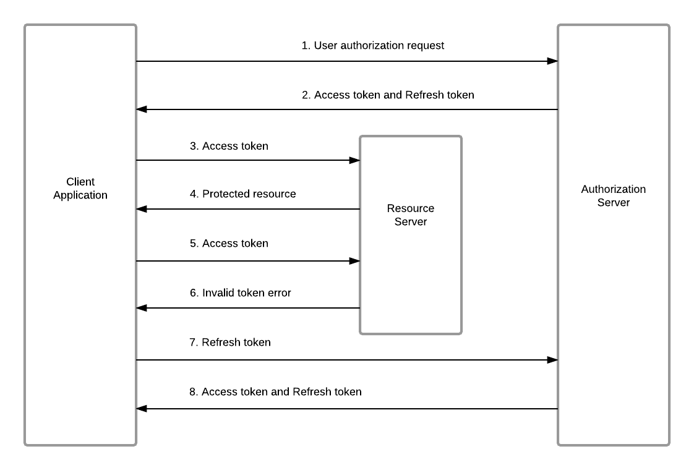

# Speed Money Wise Portal

## What is the project?

Speed Money Wise is a multinational financial services company, that enables clients to transfer money across the world almost instantaneously.

The company currently uses WhatsApp to keep track of transactions made which has proven to be very inefficient.

The solution we shall provide is a web portal that allows the company to efficiently administrate its transactions and keep track of the customers involved in those transactions.

Next to those core functionalities, the system will also have settings that allow the administrator **(superuser)** to input supporting data for the transaction creation process and to manage the access control of the users in the system.



Figure 1: High-Level Overview Of Process Flow

## How will we build the project?

The infrastructure of this project is split into 2 parts, the frontend, and the backend.



Figure 2: High-Level Overview Of Project Infrastructure.

### The Frontend

To build the frontend for this project we will be using the Typescript version of [Next.js](https://nextjs.org/blog/next-13) 13 in combination with [TailwindCSS](https://tailwindcss.com/). Furthermore, we will be using various other packages to aid in certain aspects of the project.

#### Authentication

For the authentication part of our frontend application, we will utilize [NextAuth](https://next-auth.js.org/) which provides us with an easy way to authenticate our users and maintain a user session across our application. The provider we’ll be using is the [`CredentialsProvider`](https://next-auth.js.org/providers/credentials).

The authentication system we will implement is a combination of access tokens and refresh tokens. The user will log into the system with their credentials and receive an access token and a refresh token.

The access token will expire in a short amount of time which will cause the client to request a new token with the refresh token.



Figure 3: Authentication Process

#### Authorization

!!! note "There is a [usePermission hook example](https://gist.github.com/N3RDCLASH/576d92a71d605b824b5ebbb4527bad09)"

#### User Interface

The user interface of this application will be styled with TailwindCSS. The project will consist of a combination of completely **custom-built components** and some **pre-built functional components** that will be styled using tailwind.

The libraries we'll be using for the "headless" components are [Headless UI](https://headlessui.com/) and [Tanstack Table](https://tanstack.com/).

##### Components

The components that will have to be built for this project are:

- Sidebar
- Client Form
- Table
- Button
- Etc...

The goal is to reuse build components we can reuse many times within this project but also future projects.

###### Sidebar

The sidebar component will be the main navigation component for this portal.

The requirements for this component are:

- The component should accept items prop in which a config array can be passed.
- The sidebar will generate its sidebar item based on the objects in the array.
- The sidebar will use a permissions hook to determine if the user has the permissions to visit that route and will render based on that condition.

###### Client Form

The client form will be used to register client information. The form will be used 3 times in the application:

1. To record sender information when registering a transaction.
1. To record reciever information when registering a transaction.
1. To explicitly register a new client.

The requirements for this component are:

- The form should be able to query our api to check if the user who's name were typing is already in our records and then autofill its fields if they exist.
- The form should have a prop that can enable or disable the autofill capability.

###### Table

The table can be used to display various amounts of information. For the table component we will use Tanstack Tables so we don't have to implenent table functionility from scratch.

###### Button

#### State Management

!!! note "Check out a helpful Zustand tutorial [here](https://www.youtube.com/watch?v=KCr-UNsM3vA)."

The state management solution we will be using is [`zustand`](https://docs.pmnd.rs/zustand/getting-started/introduction). Zustand is very simple and straightforward state management solution.

#### Data Fetching

Our data fetching stack will consist out of two libraries [`axios`](https://www.npmjs.com/package/axios) and [`react-query`](https://www.npmjs.com/package/react-query). `axios` is a http client that simplifies the concept of making http requests.`react-query` is a set of custom hooks that makes fetching, caching, and updating asynchronous or server state in React easy.

An example of how these two libraries will work together in our project.

`axios` is being used to get data from the `jsonplaceholder` API.

file: `src/services/post.service.ts`

```ts
import axios from "axios";

export const getPosts = async () => {
  const res = await axios.get("https://jsonplaceholder.typicode.com/posts");
  return res.data;
};
```

file: `src/app/query-example/page.tsx`

`react-query` is used to implement gather the data and the request completion status easily.

For more information check out the `react-query` [documentation](https://react-query-v3.tanstack.com/)

```ts
'use client';

import { getPosts } from "@services/example.service"
import { useQuery } from "react-query"
import ClockLoader from "react-spinners/ClockLoader";

const TestPage = () => {
    const { data: posts, isLoading } = useQuery<IPost[]>("posts", getPosts)

    return <div className="flex flex-col gap-4 items-center justify-center">
        <h1 className="text-2xl">React Query Example</h1>
        {
            <ClockLoader
                color="#fff"
                loading={isLoading}
                size={90}
                aria-label="Loading Spinner"
                data-testid="loader"
            />}
        <div className="grid grid-cols-4 grid-flow-row gap-3">
            {posts && posts.map(({ id, title, body, userId }) => <div key={id} className="bg-green-500 flex flex-col p-4 gap-6">
                <span className="text-xl">
                    {title}
                </span>
                <span>
                    Posted By User: {userId}
                </span>
                <span>
                    {body}
                </span>
            </div>)}
        </div>
    </div>
```

<pre>

</pre>

### The Backend

!!! note "when adding a custom fee the selected fee_id should be null in the transactions body"

#### Authentication

#### Authorization

TODO: write these doc sections

**\*note: sender and receiver forms should autofill or make a new transfer record**
